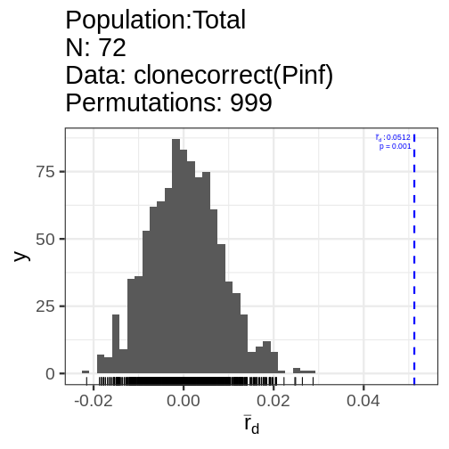

:::::::::::::::::::::::::::::::::::::: questions 

- Does this example work if you have never used the package before?

::::::::::::::::::::::::::::::::::::::::::::::::

::::::::::::::::::::::::::::::::::::: objectives

- Introduce the {poppr} package
- Demonstrate resampling of $\bar{r}_d$

::::::::::::::::::::::::::::::::::::::::::::::::

## Introduction

The standardized index of association ($\bar{r}_d$) is a method to assess
multilocus linkage disequilibrium in a random sample from a single population.

This can be calculated via the {poppr} package:


```r
library("poppr")
library("ggplot2")
theme_set(theme_bw(base_size = 24))
data(Pinf)
print(Pinf)
```

```{.output}

This is a genclone object
-------------------------
Genotype information:

   72 multilocus genotypes 
   86 tetraploid individuals
   11 codominant loci

Population information:

    2 strata - Continent, Country
    2 populations defined - South America, North America
```

```r
Pinf_ia <- ia(Pinf, sample = 999)
```


```r
print(Pinf_ia)
```

```{.output}
        Ia       p.Ia      rbarD       p.rD 
0.65243253 0.00100000 0.07166177 0.00100000 
```

We can also clone-correct the data to remove repeated genotypes, which may 
represent resamples of the same genet. 


```r
Pinf_cc <- ia(clonecorrect(Pinf), sample = 999)
```



```r
print(Pinf_cc)
```

```{.output}
        Ia       p.Ia      rbarD       p.rD 
0.47044566 0.00100000 0.05124452 0.00100000 
```

This index has no known distribution, but we can get an idea of the spread by 
resampling it by the unique number of mulitlocus genotypes.


```r
# Calculate the resampled index
Pinf.resamp <- resample.ia(Pinf, reps = 999)

# Create the plot
library("ggplot2")
ggplot(Pinf.resamp[2], aes(x = rbarD)) +
  geom_histogram(bins = 30) +
  geom_vline(xintercept = Pinf_ia[3]) +
  annotate("label", x = Pinf_ia[3], y = 60, label = "Observed Index", hjust = 0) +
  geom_vline(xintercept = Pinf_cc[3], linetype = 2) +
  annotate("label", x = Pinf_cc[3], y = 50, label = "Observed Index (clone-corrected)", hjust = 0) +
  xlab(expression(bar(r)[d])) +
  xlim(c(0, NA))
```

```{.warning}
Warning: Removed 1 rows containing missing values (geom_bar).
```

<div class="figure" style="text-align: center">

<p class="caption">Distribution of the index of assocation for 999 samples of 72 genotypes</p>
</div>


::::::::::::::::::::::::::::::::::::: keypoints 

 - This is a demo of the {poppr} package

::::::::::::::::::::::::::::::::::::::::::::::::

